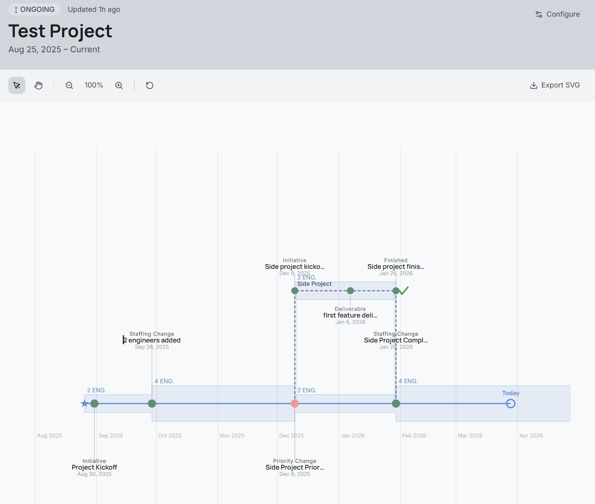
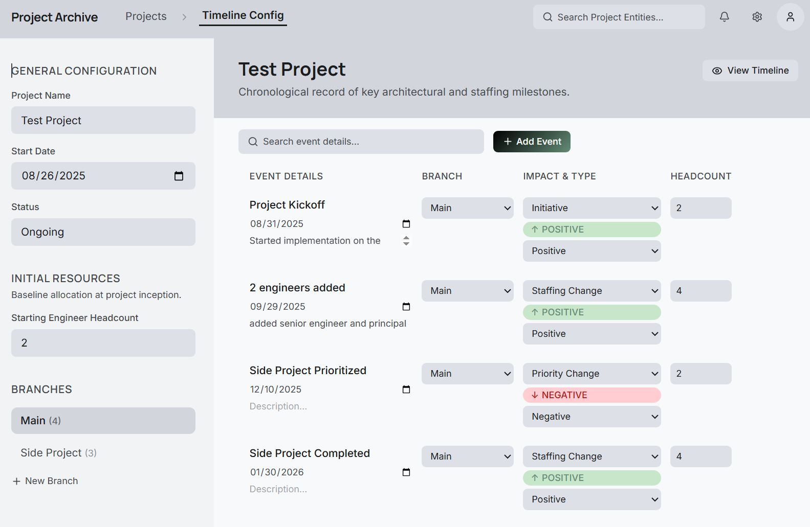

# Project Archive

A visual, historical record of a project's lifecycle — capacity, decisions, and impediments plotted as an interactive timeline. Built for non-technical executive audiences who need to understand the realities and challenges of a long-term project at a glance, or project leaders that need to diagnose or review circumstances of a project.



---

## Prerequisites

- **Node.js** v18 or later
- No external database — SQLite is used locally via Prisma

---

## Getting Started

```bash
# 1. Install dependencies
npm install

# 2. Generate the Prisma client
npx prisma generate

# 3. Apply database migrations
npx prisma migrate deploy

# 4. Start the development server
npm run dev
```

Open [http://localhost:3000](http://localhost:3000) and navigate to **Projects** to begin.

> **Note:** `app/generated/` is git-ignored. You must run `npx prisma generate` after every fresh clone or schema change before the app will compile.

---

## Architecture

| Layer | Technology | Why |
|---|---|---|
| Framework | Next.js 16 (App Router) | Full-stack routing and API in one place |
| Styling | Tailwind CSS v4 | Design tokens from a single config source |
| Visualization | D3.js | Custom timeline rendering with zoom, pan, capacity bands, and branching — no off-the-shelf library is sufficient |
| ORM | Prisma 7 | Typed queries; SQLite today, Postgres-ready tomorrow via a single config change |
| Database | SQLite | Zero infrastructure for local development |

```
/app
  /projects              → Projects list
  /projects/[id]         → Project detail
  /timelines/[id]        → Timeline Configuration (edit events, branches)
  /timelines/[id]/view   → Project Timeline visualization (read-only)
  /api/...               → REST API routes (projects, timelines, events)
/components
  /timeline              → D3 visualization components
  /ui                    → Design system primitives (Button, Input, Select, etc.)
/lib
  db.ts                  → Prisma client singleton
  utils.ts               → Date formatting, capacity segment derivation
/prisma
  schema.prisma          → Data model
  migrations/            → SQL migration history
```

---

## Features

**Projects**
- Create and manage multiple projects, each with a status, start date, and starting engineer headcount
- Navigate directly to a project's timeline view or configuration from the projects list

**Timeline Configuration**
- Add, edit, and delete events on a chronological timeline
- Event types: Deliverable, Priority Change, Staffing Change, Initiative, Key Decision, Impediment, Finished
- Each event has an impact sentiment (Positive, Negative, Neutral) and optional headcount at time of event
- Create branching timelines to represent adjacent initiatives or priority shifts
- Finished events on branches support a conclusion type (Paused, Cancelled, Successful) and can optionally return resources to the main project

**Timeline Visualization**
- Interactive horizontal timeline with zoom and pan
- Capacity band showing engineer headcount over time, driven by events with recorded headcount
- Branch timelines rendered as dashed lines diverging from the main line, with their own capacity bands
- Branch conclusions rendered as visual symbols (pause bars, red ✕, green checkmark)
- Event dots colored by sentiment; labels alternate above and below the line to reduce overlap
- "Today" indicator on ongoing projects
- Tooltip on event hover with name, type, date, description, and headcount
- Export the visualization as an SVG



---

## Development

```bash
# Run tests
npm test

# Run tests in watch mode
npm run test:watch

# Lint
npm run lint

# After editing prisma/schema.prisma
npx prisma migrate dev --name <migration-name>
npx prisma generate
```

**Adding a migration:** edit `prisma/schema.prisma`, then run `prisma migrate dev`. The generated client in `app/generated/` is rebuilt automatically and should not be committed.

---

## License

Copyright 2026 Project Archive Contributors

Licensed under the Apache License, Version 2.0 (the "License");
you may not use this file except in compliance with the License.
You may obtain a copy of the License at

    http://www.apache.org/licenses/LICENSE-2.0

Unless required by applicable law or agreed to in writing, software
distributed under the License is distributed on an "AS IS" BASIS,
WITHOUT WARRANTIES OR CONDITIONS OF ANY KIND, either express or implied.
See the License for the specific language governing permissions and
limitations under the License.
